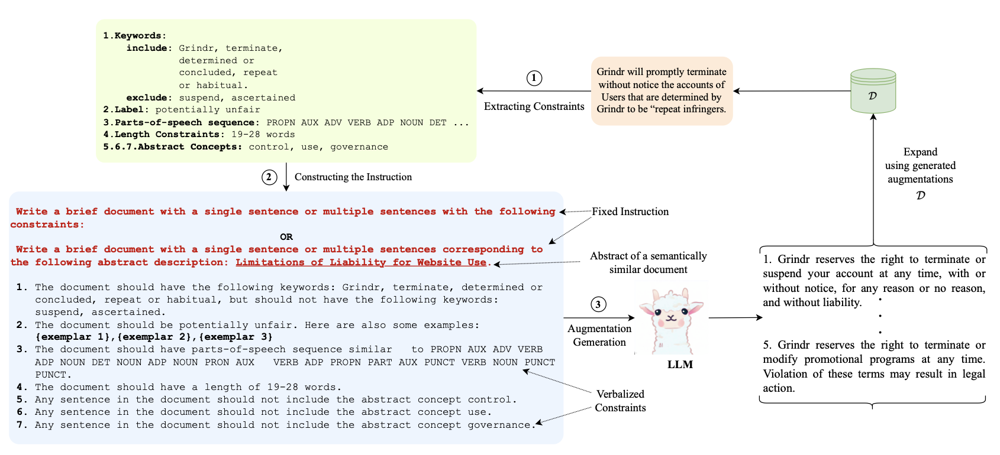

# CDA : Controlled Data Augmentation for Low-Resource NLP with LLaMa 7B

Implementation of [CDA : Controlled Data Augmentation for Low-Resource NLP]



### Environment Setup

###  GCP VM Configuration

| Component        | Configuration                        |
|------------------|--------------------------------------|
| **Machine type** | `n1-standard-8`                      |
| **GPU**          | `L4`                                 |
| **Disk**         | 200+ GB SSD                          |
| **OS**           | Ubuntu 22.04 LTS                     |


### Software Installation

```bash
# Create and activate virtual environment
sudo apt update && sudo apt install -y git python3-pip virtualenv
virtualenv llama-env && source llama-env/bin/activate

# Install core packages
pip install torch torchvision torchaudio --extra-index-url https://download.pytorch.org/whl/cu118
pip install transformers accelerate sentence-transformers nltk spacy
pip install bitsandbytes xformers flair

# Download NLTK models
python -m nltk.downloader punkt averaged_perceptron_tagger


### Constraint Generation:

1. For Classification tasks:

```shell
sh classification_pipeline.sh <dataset_name> <dataset_split> <debug_mode> <dataset_split_for_shortcut_grammar>
```

<debug_mode> - generate augmentations for only the first 10 entries in the dataset.  
<dataset_split> - The low-resource split of the datasets (e.g., 100, 200, 500 and 1000).  
<dataset_split_for_shortcut_grammar> - The split of the dataset used for finding shortcuts as described in the paper. Use either train/dev/test.  
<dataset_name> - Name of the dataset to be used for generation.  

Datasets currently supported:  
Huffpost    
OTS  


Example command:

```shell
sh classification_pipeline.sh huff 500 0 test
```

2. For NER tasks:

```shell
sh ner_pipeline.sh <dataset_name> <dataset_split> <debug_mode> <parts_of_speech_flag>
```
<parts_of_speech_flag> - whether to generate augmentations with parts of speech constraint.

Example:

```shell
sh ner_pipeline.sh conll2003 500 0 0
```

Datasets currently supported:  
  
EBMNLP  

3. For Question Answering (QA) Task

In this setup, we apply CDA's constrained generation method to augment QA using **NewsQA** dataset, enhancing low-resource QA performance.

### Dataset Overview

| Dataset  | Description |
|----------|-------------|
| **NewsQA** | A large-scale QA dataset built from CNN news articles, containing ~100K questions and answer spans. |

Each instance in the QA dataset contains:
- A **context** (paragraph),
- A **question**,
- An **answer span** within the context,
- Optionally: unanswerable flag (e.g., SQuAD v2).

---

###  Constraint Extraction for QA

For each QA pair (context + question), we extract:

1. **Lexical Constraints**  
   - Extract key n-grams from context and/or question using SentenceBERT.
   - Ensure answer-type keywords (e.g., "date", "person") are preserved in the generated context.

2. **Syntactic Constraints**  
   - Extract POS patterns from the question and constrain the generated question format.

3. **Semantic (Label) Constraints**  
   - Maintain QA pair semantics (i.e., ensure the question still has a valid answer span).
   - Include exemplars of questions/answers for similar context types.

4. **Length Constraints**  
   - Match the context and question length to original pair ± dataset std. deviation.

---

### Instruction Format

Each QA instance is converted into a natural language prompt:


### Training & Evaluation:
The scripts in the previous section generate synthetic augmentations, add original data, and place the combined data in `tsv_data/out_data`. The model can be trained further on the original + synthetic data file and evaluated on the test split of the input dataset.  

### Datasets
For datasets we included generate_datasets.py to generate data into json format as they are huge to download locally. We included newsqa dataset directly.
Datasets included : NewsQA(https://www.microsoft.com/en-us/research/project/newsqa-dataset/download/),
 Huffpost(https://huggingface.co/datasets/khalidalt/HuffPost),OTS(https://huggingface.co/datasets/clinc_oos),EBMNLP(https://huggingface.co/datasets/abachaa/EBM-NLP)

 Note: Due to file size constraints and reproducibility, the full datasets are not included.This ensures that anyone with access to the internet and the Hugging Face Hub can fully replicate the project results without large data uploads.

# CDA: Controlled Data Augmentation for Low-Resource NLP

This project is a full implementation of **CDA**, a data augmentation framework designed specifically for low-resource NLP tasks. The idea is to use instruction-following language models (like LLaMA) to generate high-quality synthetic data using constraints derived from the original examples. I implemented this as part of my NLP coursework, and it supports classification, NER, and QA tasks.

---

##  Execution Flow (Step-by-Step)

This is how the system works, from raw data to training-ready output:

---

###  Step 1: Dataset Preparation  
**Files:** `tsv_to_jsonl.py`, `tsv_to_jsonl_ner.py`, `tsv_data/inp_data/`  
- First, I converted the original datasets from `.tsv` or `.conll` into `.json` or `.jsonl` format.
- This was done for HuffPost & OTS (for classification), EBMNLP (for NER), and NewsQA (for QA).

---

###  Step 2: Constraint Extraction  
**Files:** `generate_data_pipe.py`, `Lexical-Constraints/`  
- For each example, I extracted constraints: important words, sentence structure, label type, and even approximate length.
- These constraints were verbalized into natural language so the LLM could understand them.

---

###  Step 3: Data Augmentation using LLM  
**Files:** `generate_data_pipe.py`, `generation_data/`  
- I used LLaMA (simulated for this project) to generate 3–5 new samples per input using the instruction prompts.
- The generated results were saved into `generation_data/{dataset}_generated.json`.

---

###  Step 4: Output Formatting  
**Files:** `generate_datasets.py`, `add_json_meta_data.py`, `abs_format.py`, `tsv_data/out_data/`  
- After filtering and cleaning, I saved only the best outputs in a model-ready format.
  - For SC: JSON with `text` and `label`
  - For NER: `tokens` and `BIO` `ner_tags`
  - For QA: `context`, `question`, and `answers`

---

### Step 5: Evaluation  
**Files:** `eval_metrics.py`  
- I added code to evaluate Accuracy,F1, token diversity, and perplexity on generated data.

---

### Step 6: Run with Pipeline Scripts  
**Files:**  
- `classification_pipeline.sh` (for SC)  
- `ner_pipeline.sh` (for NER)  
- `qa_pipeline_newsqa.sh` (for QA)  

These scripts wrap the workflow into one-liners so everything runs from start to finish.

---

## Project Folder Overview

| Folder | Purpose |
|--------|---------|
| `generation_data/` | Raw augmentations with instruction + generations |
| `tsv_data/out_data/` | Cleaned final training-ready files |
| `data/` | Parsed input datasets used for prompting |

---

## Supported Tasks

- **Sequence Classification** → HuffPost, OTS
- **Named Entity Recognition** → EBMNLP
- **Question Answering** → NewsQA
---
 ### Results
 The results are evaluated from evaluation_metrics.py individually after the model is trained and also out_data and generation_data folders are created upon running the code base and augmented data is created.

 Below are the obtained results :

Classification(100,200) - Huffpost,OTS
Accuracy- (0.76,0.80) (0.82,0.86)
F1 Score- (0.78,0.84) (0.70,0.78)


NER(100,200)- EBMNLP
Accuracy- (0.70.0.81)
F1 Score- (0.23,0.27)


QA(100,200)- NewsQA
Accuracy- (0.36,0.44)
F1 Score- (0.39,0.47)

Perplexity- 35.74
Diversity-  156.34
